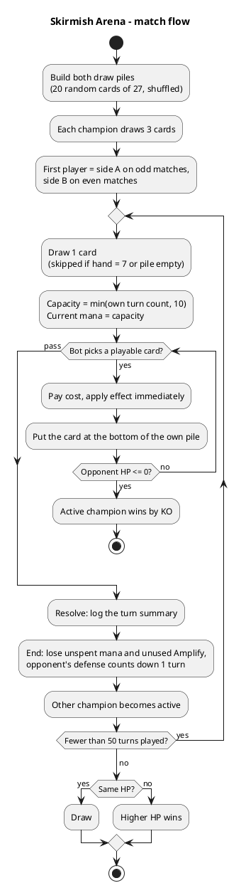
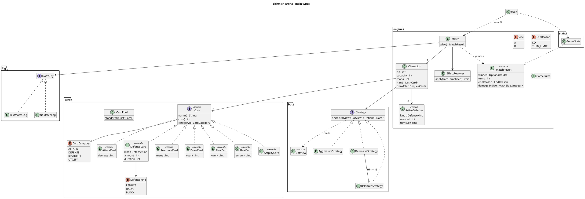

# Skirmish Arena — Design decisions

This file records the rules we decided where the brief was silent. It is the single source of truth for the engine: code and tests must match it, and any rule change updates this file in the same commit.

## 1. Brief vs. decisions at a glance

| Topic | The brief says | We decided |
|---|---|---|
| Build | Plain Java with Maven | No Maven: our organization blocks Maven builds. The project is built by IntelliJ or plain `javac`; JUnit 5 comes as a single jar in `lib/` |
| Champion | 30 HP | 30 is also the maximum: healing never goes above it |
| Deck | 20 cards, pool of ≥ 15 distinct types | Pool of 27 cards / 16 types (§4). Each match, each champion gets its own random 20 of the 27 |
| Starting hand | — | 3 cards each; hand limit 7 |
| First player | — | Alternates every match: side A starts match 1, side B match 2, and so on |
| Mana | +1 per turn, capped at 10 | Hearthstone-style: capacity = the champion's own turn count, max 10; refilled every turn; unspent mana is lost |
| Resource cards | grow the caster's mana pool | Restore mana up to the current capacity; never raise the capacity (§3) |
| Play phase | spend affordable mana | Any number of cards while mana allows; each effect applies immediately |
| Played cards | — | Go to the bottom of the player's own draw pile |
| Match end | 0 HP, or after 50 turns | 50 turns in total (25 per champion); then the higher HP wins, equal HP is a draw |
| Determinism | deterministic simulation | One seed per run drives every random choice (§8) |
| Bots | e.g. Aggressive and Defensive | Aggressive, Defensive and Balanced; Defensive plays like Balanced until its HP drops below 15 (§7) |

## 2. Match setup

1. Each champion takes its own copy of the 27-card pool, picks 20 cards at random and shuffles them: this is its draw pile. The 7 other cards are not used in this match.
2. Each champion draws 3 cards.
3. The first player alternates with the match number: odd matches → side A, even matches → side B. Side A is the first bot given on the command line.

## 3. Turn structure

A turn is one champion's turn. Turns are numbered 1 to 50 across both champions.

| Phase | What happens |
|---|---|
| Draw | Draw 1 card from the top of the own draw pile. Skipped, with no penalty, if the hand already holds 7 cards or the pile is empty. The first player also draws on turn 1. |
| Mana | Capacity = min(own turn count, 10). Current mana = capacity. |
| Play | The bot picks one card at a time. For each card: pay its cost, apply its effect at once, put the card at the bottom of the own draw pile. If the opponent reaches 0 HP, the match ends immediately. The phase ends when the bot passes. |
| Resolve | Effects are already applied, so this phase only records the turn summary (HP, mana, active defenses) in the log. |
| End | Unspent mana is lost. An unused Amplify is lost. The opponent's active defense counts down by 1 turn, since it has just protected them. |

**Resource cards** restore mana within the current capacity: current mana = min(current + X, capacity). Example: capacity 5, 2 mana spent (3 left), Focus (+1) → 4 of 5. At full mana, a Resource card does nothing.



## 4. Cards

27 cards, 16 distinct types. "Amplified" is the effect when the card is played right after Amplify (§5).

| Card | Category | Copies | Cost | Effect | Amplified |
|---|---|---|---|---|---|
| Jab | Attack | 2 | 1 | 1 damage | 2 damage |
| Strike | Attack | 2 | 2 | 2 damage | 4 damage |
| Heavy Blow | Attack | 1 | 3 | 4 damage | 8 damage |
| Meteor | Attack | 1 | 5 | 8 damage | 16 damage |
| Guard | Defense | 2 | 1 | Each incoming attack card deals 1 less, for 2 turns | 2 less, 2 turns |
| Shield | Defense | 2 | 2 | Each incoming attack card deals 2 less, for 2 turns | 4 less, 2 turns |
| Barrier | Defense | 1 | 3 | Each incoming attack card deals half, rounded down, for 2 turns | Blocks everything, 2 turns |
| Aegis | Defense | 1 | 5 | Blocks every incoming attack card, for 1 turn | Blocks everything, 2 turns |
| Focus | Resource | 3 | 0 | Restore 1 mana | Restore 2 mana |
| Surge | Resource | 2 | 0 | Restore 2 mana | Restore 4 mana |
| Insight | Utility | 2 | 1 | Draw 1 card from the own pile | Draw 2 cards |
| Pickpocket | Utility | 2 | 2 | Take 1 random card from the opponent's hand | Take 2 cards |
| Bandage | Utility | 2 | 1 | Heal 1 | Heal 2 |
| Potion | Utility | 2 | 2 | Heal 2 | Heal 4 |
| Elixir | Utility | 1 | 3 | Heal 4 | Heal 8 |
| Amplify | Utility | 1 | 5 | Double the next card played this turn | — |

Totals: 6 Attack, 6 Defense, 5 Resource, 10 Utility.

## 5. Effect rules

- **Legal play**: the card costs no more than the current mana, and a Defense card needs its caster to have no active defense. The engine refuses anything else.
- **Attack**: damage = card value (doubled if amplified), then the defender's active defense applies to this card: reduce by N (minimum 0), halve rounded down, or block to 0. A champion at 0 HP is KO; HP is never shown below 0.
- **Defense**: one active defense per champion at a time. Its duration counts the opponent's turns: Guard protects during the opponent's next 2 turns. It counts down at the end of each opponent turn and disappears at 0.
- **Heal**: HP = min(HP + X, 30).
- **Insight**: draws from the own pile; stops when the hand holds 7 cards or the pile is empty.
- **Pickpocket**: takes a random card (seeded) from the opponent's hand into the own hand. Nothing happens if their hand is empty, and it stops when the own hand holds 7 cards. The stolen card now belongs to the thief: once played, it goes to the bottom of the thief's pile.
- **Resource**: see §3.
- **Amplify**: the next card played in the same turn uses its "Amplified" effect (§4). If no card follows before the end of the turn, the bonus is lost. Playing Amplify while one is already pending adds nothing (no ×4). This can only happen with a stolen second Amplify.
- A legal card with no effect (Focus at full mana, Bandage at 30 HP) is allowed by the engine; bots avoid it (§7).

## 6. End of match

- **KO**: a champion at 0 HP loses immediately. Only the active champion deals damage, so both cannot drop to 0 together.
- **Turn limit**: after turn 50, the champion with more HP wins; equal HP is a draw. There is no further tie-break.

## 7. Bots

Each bot is an ordered list of rules. Before each card, it walks the list and plays the card chosen by the first rule that applies; when no rule applies, it passes. Bots use no randomness and never change the game state themselves.

**Shared vocabulary**

- *Playable*: legal (§5).
- *Useful*: a Resource card is useful when current mana < capacity; a heal when HP < 30; Insight when the own pile is not empty; Pickpocket when the opponent's hand is not empty. Attack and Defense cards are always useful.
- *Best*: best attack = most damage; best heal = biggest heal; best defense = Aegis, then Barrier, then Shield, then Guard; best Resource card = the one that restores the most mana given what is missing, and on a tie the smaller card (the bigger one is kept for later).
- *Amplify combo*: a bot plays Amplify only if, after paying its 5 mana, it can still afford its combo target (the best card of the kind named below that it holds). While Amplify is pending, the bot plays that target.

**Aggressive**: always plays the highest-damage playable card (brief)

1. Amplify pending → best playable attack.
2. Amplify combo with the best attack in hand.
3. Best playable attack.
4. No attack playable → useful Resource card (it may make an attack affordable).
5. Useful Insight, then useful Pickpocket (they may bring an attack).
6. Best useful heal.
7. Best playable defense.

**Defensive**: prioritizes defense and healing once HP drops below 15 (brief)

- HP ≥ 15: plays exactly like Balanced.
- HP < 15, checked again before every card:
  1. Amplify pending → best playable heal.
  2. Best playable defense.
  3. Amplify combo with the best heal in hand, if HP < 30.
  4. Best useful heal.
  5. Useful Resource card.
  6. Useful Insight, then useful Pickpocket.
  7. Best playable attack.

**Balanced**: one attack, one defense, one heal, then more attacks (the team's third bot)

1. Amplify pending → best playable attack.
2. No attack played yet this turn → Amplify combo with the best attack in hand, otherwise best playable attack.
3. Best playable defense.
4. No heal played yet this turn → best useful heal.
5. Useful Resource card.
6. Useful Insight, then useful Pickpocket.
7. Best playable attack.

## 8. Randomness and determinism

- The run takes one `--seed` (default 42). A single `java.util.Random` is created from it and passed to everything that needs chance.
- Chance is used for exactly three things: picking the 20 deck cards, shuffling them, and choosing the card taken by Pickpocket. Nothing else.
- The matches of a run share that `Random` one after the other, so match k depends on the matches before it. The sample log is always match 1.
- Same seed and same options → the same log and the same stats. A test checks it.

## 9. Output

**Stats** for a run of N matches:

- Win rate per side: A wins %, B wins %, draws %.
- Average match length, in turns (50 at most).
- Average damage per match, per side: damage actually dealt after defense, overkill included.
- How matches ended: KO vs turn limit (to check §11).

**Sample log**: the full turn-by-turn log of match 1, written to `sample-match.log`. Target format:

```text
=== Match 1: Aggressive (A) vs Defensive (B), seed 42. A starts ===
--- Turn 7: A | HP A 24, B 19 | mana 4/4 ---
A draws Strike. Hand: Strike, Jab, Guard, Focus
A plays Strike (2 mana): 2 damage, B's Guard absorbs 1 -> 1 damage. B: 18 HP
A plays Jab (1 mana): 1 damage, B's Guard absorbs 1 -> 0 damage. B: 18 HP
A plays Focus: +1 mana (2/4)
A plays Guard (1 mana): incoming attack cards deal 1 less during B's next 2 turns
A passes, 1 mana unused
End of turn 7: B's Guard has 1 turn left
```

## 10. Architecture

Root package `com.skirmisharena`:

| Package | Contents |
|---|---|
| `card` | `Card` (sealed interface) and one record per effect: `AttackCard`, `DefenseCard`, `ResourceCard`, `DrawCard`, `StealCard`, `HealCard`, `AmplifyCard`; `CardCategory`; `DefenseKind`; `CardPool` (the 27 cards) |
| `engine` | `GameRules` (constants), `Champion` (mutable state), `Match` (runs one match, phases), `EffectResolver` (applies a card), `ActiveDefense`, `MatchResult`, `Side`, `EndReason` |
| `bot` | `Strategy`, `BotView` (read-only snapshot given to a bot), `AggressiveStrategy`, `DefensiveStrategy`, `BalancedStrategy`, `BotType` (command-line name → strategy) |
| `log` | `MatchLog` (interface), `TextMatchLog` (sample match), `NoMatchLog` (bulk runs) |
| `stats` | `SeriesStats` |
| root | `Main`: parses arguments, runs the N matches, prints stats, writes the sample log |



## 11. Risks to verify

- **KOs will probably be rare.** Back-of-envelope: each champion sees about 28 cards per match (3 in the starting hand + 25 draws). About 22 % are attacks, averaging 3 damage: roughly 19 damage dealt, against about 10 HP of heals, before any defense. From 30 HP, most matches should reach turn 50 and be decided on HP, with an average length close to 50. The stats (§9) will confirm or refute this. If confirmed, candidate changes are drawing 2 cards per turn or raising attack values. We leave this open on purpose: changing a rule mid-build is part of the exercise (PLAN.md, step 11).
